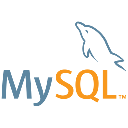

# Hello, Me chamo Filipe Souza 👋

### Sobre mim

- 🧔🏽 Tenho 26 anos, sou brasileiro e resido no RS - Brasil
- 🌱 Atualmente focado em ReactJS e realizando o curso ignite da [Rocketseat](https://rocketseat.com.br/) 
- 💻 Procurando oportunidades como desenvolvedor Front-end
- 🥅 Metas 2021: Completar o ignite [Rocketseat](https://rocketseat.com.br/) e realizar o curso de React Avançado do [Willian Justen](https://www.udemy.com/course/react-avancado/) e Iniciar um bom curso de inglês
- 📚 Sempre tentando melhorar minhas habilidades de programação com exercícios e projetos
- ⚡ Eu amo tecnologia e video games, sou interessado também em política e vida no exterior

### Linguagens e ferramentas

 
 
 

### Faça contato

 

 
 
